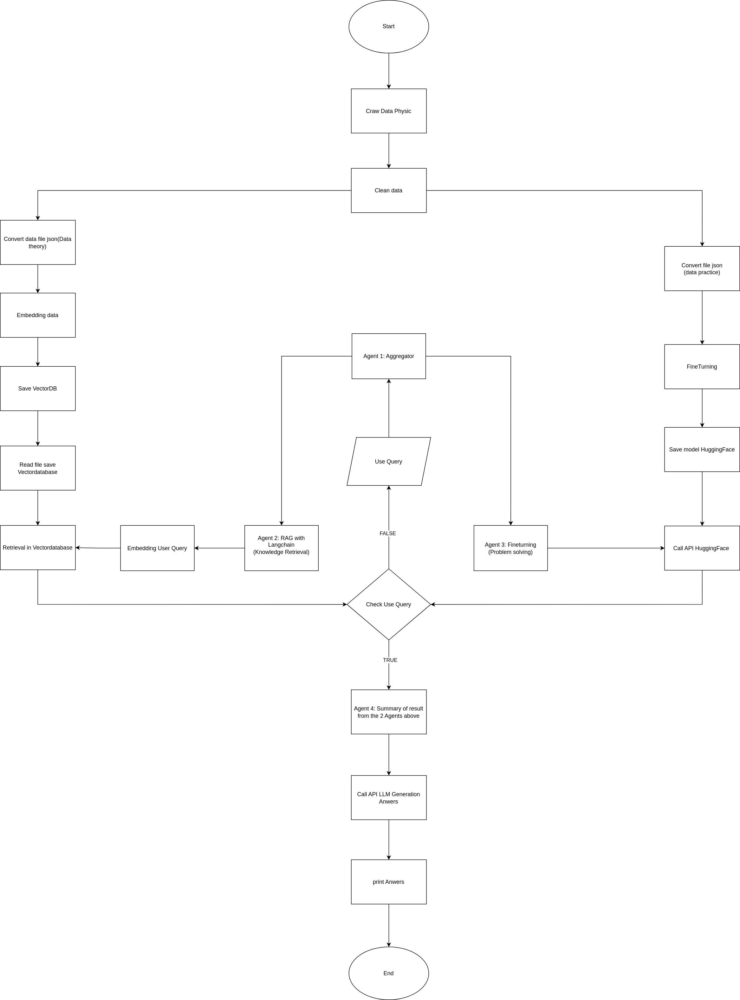

# 📘 Building a Physics Problem Solving System
## 🚀 Giới thiệu  
Dự án **Chatbot giải bài tập Vật lý** được phát triển bởi team AI. Hệ thống được thiết kế dưới dạng một website chatbot, sử dụng kỹ thuật **RAG (Retrieval-Augmented Generation) , Multi LLM, Fine-turning Model**

## 👨‍💻 Thành viên nhóm

| Họ tên             | Vị trí - Vai trò                            |
|--------------------|------------------------------------|
| **Phạm Văn Hùng**  | Leader  - Thiết kế hệ thống RAG , fine-turning model, viết package , clean data, tạo Multi Agent.       |
| **Vũ Đức Hải**     | Leader - Thiết kế & Triển khai Web. |
| **Nguyễn Ngọc Hải**  | Thành viên - Clean data, viết package.
| **Trần Hữu Phúc**  | Thành viên - Crawl data.                         |
| **Đàm Xuân Long**| Thành viên - Clean data.                         |

---
### Version 1:
Công nghệ sử dụng: RAG + fine turning model sử dụng QLora 4bit trên bộ dữ liệu khoảng 2k câu hỏi.

### Version 2:
Để tối ưu cho khả năng suy luận thì mình sử dụng AI Agent.

## 💡 Ý tưởng tổng quan

## 🧩 Viết package (Nguyễn Ngọc Hải & Phạm Văn Hùng)

## 🌐 Thiết kế & Triển khai Web (Vũ Đức Hải & Phạm Văn Hùng)

